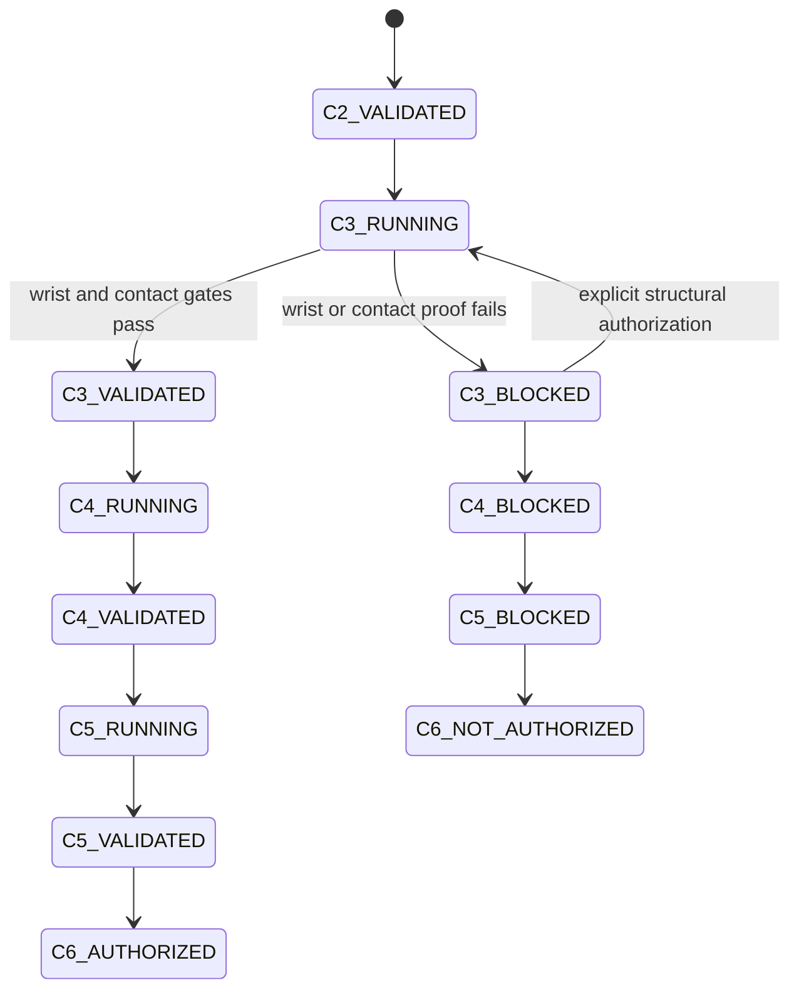

# Stage 16 bounded recovery

Every failure transition persists: phase, classified failure, evidence, attempt
number, predefined fallback, repair, rerun scope, result, and remaining budget.
Limits are three repairs per class, five reruns per phase, three backend
switches, and twenty major repairs. Exhaustion escalates rather than looping.

Stage-specific budgets are explicit in code:

- `Stage161RecoveryStateMachine`: at most 3 repairs per class, 5 reruns per
  phase, and 12 major transitions.
- `Stage162RecoveryStateMachine`: at most 3 repairs per class, 5 reruns per
  phase, and 16 major transitions.
- `Stage163RecoveryStateMachine`: at most 3 repairs per class, 5 reruns per
  phase, and 16 major transitions.
- `Stage161DynamicCouplingStateMachine`: ordered
  `STEP_A_PD -> STEP_B_CONTACT -> STEP_C_VELOCITY_RESET -> STEP_D_OBJECT_ORACLE
  -> STEP_E_DYNAMIC_FEASIBILITY -> FINAL_REQUALIFICATION`, with the Stage-16.1
  budget and no PPO transition.

The Stage 16.1 run classified observed failures as `OBJECT_DYNAMICS_FAILURE`
and `ACTUATOR_OR_PD_FAILURE`; the current result remains
`STAGE16_1_CONTROLLABILITY_BLOCKED`, with no PPO started behind a failed gate.
The separate Stage-16.1a log is
`.local/reports/stage16_dynamic_coupling_v1_rerun1/failure_transition_log.jsonl`.
It records `REFERENCE_DYNAMICAL_INFEASIBILITY` for the current
fixed-base/20D/contact setup, rather than relabeling it as actuator or PPO
failure.

GPU OOM follows `4096 -> 2048 -> 1024 -> 512 -> 256` with explicit shard
accounting. PPO numerical failures may roll back only to an atomic checkpoint
and must revalidate observation/reward/log probability first. Learning stalls
require diagnostics before the one globally fixed fallback profile; no
clip-specific reward, PD, or action scale is permitted.

## Stage 16-B bounded recovery

The world-wrist extension uses the same fail-closed principle.
`Stage16BAdaptiveOracleStateMachine` limits every failure class to three
repairs, formal reruns to five, major transitions to twelve, and CEM budget
upgrades to one. The selected 32x3 adaptive H1/H5/H10 run passes `170650`
20/20 but fails `170105` 20/20 at 80% progress. The bounded 48x4 `170105`
upgrade reaches 82.5% and still fails at 5.002 cm axis error. The single
global upgrade is consumed and closes as `CEM_CONTACT_MODE_MISS` rather than
looping.

No clip-specific tuning, object pose write, physical-parameter selection by
tracking score, additional horizon/budget, or PPO bypass is permitted. PPO
remains `NOT_STARTED_GATE_BLOCKED`; the final Oracle log is
`.local/reports/stage16b_adaptive_oracle_single_ppo/oracle_failure_transitions.jsonl`.

## Stage 16-C.0--C.4 recovery

`Stage16C0RecoveryStateMachine` limits each installation/runtime failure class
to three repairs, all retries to four, installation-method switches to two, and
major transitions to sixteen. It never upgrades a driver, kernel, system glibc,
or system CUDA, and never converts a CPU fallback into a GPU pass. C.1 uses a
separate bounded recovery contract; deterministic low-vertex convex proxies
replaced converter/high-poly collision strategies that exceeded the bounded
runtime, while failed strategies remain in reports.

C.3R4 remains immutable original-timing evidence:
`C3_WRIST_ACTUATION_ARCHITECTURE_BLOCKED`. The subsequent authorized shared
factor-8 retiming preserved source keys/hashes and passed C3-0 through C3-5 as
`STAGE16C3_SEMANTIC_QUALIFICATION_VALIDATED`; C.4 then closed clean/finite at
all five bounded counts as `STAGE16C4_GPU_VECTOR_BACKEND_VALIDATED`. Neither
transition authorizes a C5 Oracle or PPO.

## Stage 16-C.5A failure-recovery state machine

`Stage16C5ARecoveryStateMachine` makes the C.5A repair budget explicit:
three repairs per failure class, five reruns per phase, one replication-method
switch, and 24 major transitions. Input/hash drift, writes outside candidate
setup, execution-rollout direct state writes, and natural baseline hard-cap
failure are fail-closed.

The only permitted fallback is `deterministic_history_replay_v1`, and only
after a passing no-clone baseline and a tensor-clone contact mismatch. It resets
candidate IDs to frame zero and advances normal 20 Hz control actions; it never
writes object state in the middle of a replay. It is not eligible in this
closeout because the natural baseline failed before O1.

R1 repaired the reset boundary and raw DirectRLEnv step ordering after the
1-candidate O0 no-peer bookkeeping repair. It then passed the independent
single-env, origin-normalization, cross-process, and telemetry controls. The
remaining same-process 33-env post-contact split is classified as
`TRUE_FROZEN_PHYSX_BASELINE_NONDETERMINISM`, producing
`STAGE16C5A_PHYSICS_CONTRACT_CHANGE_REQUIRED`. It terminates O1, fallback,
benchmark, C5B, C5C, and PPO work; it is not a recoverable tolerance-tuning
transition.

The ordered transitions are machine-readable in the ignored
`.local/reports/stage16c5a_repair_c5c_oracle/c5_failure_transitions.jsonl`.

## Stage 16-D bounded recovery

`Stage16DRecoveryStateMachine` caps repairs per failure class at three,
phase reruns at five, reward profiles at three, knot levels at three, global
optimizer upgrades at two, PPO seeds per clip at two, and learning-rate
fallbacks at one. Hash drift, hidden control, rollout state writes, source
overwrite, action mutation, unauthorized physics changes, and reward exploits
are fail-closed.

D3-S1 exposed degenerate/no-progress segments; D3-S2 was the bounded diagnostic
rerun. A trace-selection implementation defect was repaired so the best
actually evaluated candidate is retained. The shared default D3-S3 search then
produced both candidates. Geometry-audit implementations received bounded
efficiency repairs, but their metric remained formally non-comparable; that is
not repaired by changing a threshold. D.4 exported explicitly partial V1
packages, then D.5 through D.7 stopped at their entry gates. No PPO workers
started, samples remain zero, and no checkpoints exist. The ordered record is
`.local/reports/stage16d_physics_consistent_retargeting/failure_transitions.jsonl`.
