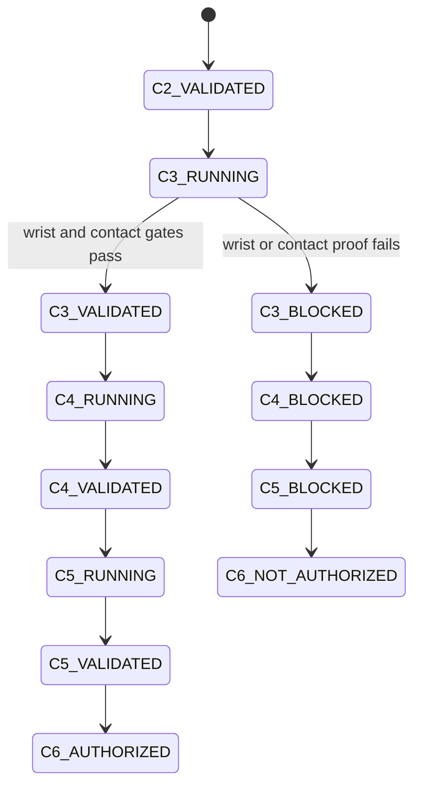

# Stage 16 bounded recovery

Every failure transition persists: phase, classified failure, evidence, attempt number, predefined fallback, repair, rerun scope, result, and remaining budget. Limits are three repairs per class, five reruns per phase, three backend switches, and twenty major repairs. Exhaustion escalates rather than looping.

Stage-specific budgets are now explicit in code:

- `Stage161RecoveryStateMachine`: at most 3 repairs per class, 5 reruns per phase, and 12 major transitions.
- `Stage162RecoveryStateMachine`: at most 3 repairs per class, 5 reruns per phase, and 16 major transitions.
- `Stage163RecoveryStateMachine`: at most 3 repairs per class, 5 reruns per phase, and 16 major transitions.
- `Stage161DynamicCouplingStateMachine`: ordered `STEP_A_PD → STEP_B_CONTACT → STEP_C_VELOCITY_RESET → STEP_D_OBJECT_ORACLE → STEP_E_DYNAMIC_FEASIBILITY → FINAL_REQUALIFICATION`, with the Stage-16.1 budget and no PPO transition.

The Stage 16.1 run classified the observed failures as `OBJECT_DYNAMICS_FAILURE` and
`ACTUATOR_OR_PD_FAILURE`; global object-mass recovery profiles 0.5, 1.0, and 5.0 kg were
executed in separate ignored run directories and did not change the failure location. The
result remains `STAGE16_1_CONTROLLABILITY_BLOCKED`; no PPO training was started behind a failed
controllability gate.

The current Stage-16.1a log is `.local/reports/stage16_dynamic_coupling_v1_rerun1/failure_transition_log.jsonl`. It recorded six bounded transitions. Step A passed, but Step B failed the pre-gate contact condition: both clips have zero actual and expected proximity contacts at static frames 0/5/10, while the formal free-object episode fails at frame 5 or 6. The classification is `REFERENCE_DYNAMICAL_INFEASIBILITY` for the current fixed-base/20D/contact setup. It is not relabeled as actuator failure or PPO failure.

GPU OOM follows `4096 -> 2048 -> 1024 -> 512 -> 256` with explicit shard accounting. PPO numerical failures roll back only to an atomic checkpoint and revalidate observation/reward/log probability first. Learning stalls require diagnostics before the one globally fixed fallback profile is attempted; no clip-specific reward, PD, or action scale is permitted.

## Stage 16-B bounded recovery

The separate world-wrist extension uses the same fail-closed principle.
`Stage16BAdaptiveOracleStateMachine` limits every failure class to three
repairs, formal reruns to five, major transitions to twelve, and CEM budget
upgrades to one. The selected 32x3 adaptive H1/H5/H10 run passes `170650`
20/20 but fails `170105` 20/20 at 80% progress. The bounded 48x4 `170105`
upgrade reaches 82.5% and still fails at 5.002 cm axis error. The single
global budget upgrade is consumed. The final class is
`CEM_CONTACT_MODE_MISS` under the frozen engineering simulator; recovery is
exhausted and the lane closes as partial rather than looping.

No clip-specific tuning, object pose write, physical-parameter selection by
tracking score, additional horizon/budget, or PPO bypass is permitted. PPO
remains `NOT_STARTED_GATE_BLOCKED`; the PPO recovery log is empty because no
PPO transition occurred. This is not a training failure. The final oracle
log is `.local/reports/stage16b_adaptive_oracle_single_ppo/oracle_failure_transitions.jsonl`.

## Stage 16-C.0 bounded recovery

`Stage16C0RecoveryStateMachine` limits each installation/runtime failure class
to three repairs, all retries to four, installation-method switches to two,
and major transitions to sixteen. Its failure classes separate host/driver,
glibc, Python, Torch/CUDA, Isaac Sim import, Isaac Lab import, EULA,
network/cache, headless rendering, and GPU PhysX failures. It never upgrades a
driver, kernel, system glibc, or system CUDA, and it never converts a CPU
fallback into a GPU pass.

Two installation retries were consumed before runtime. The first repaired the
legacy `flatdict==4.0.1` build by pinning setuptools 80.9.0 and prebuilding it
without build isolation. The second restored Isaac Sim kernel dependency pins
with IPython 8.37.0, ONNX 1.21.0, psutil 5.9.8, and typing_extensions 4.12.2.
No installation-method switch was used. The official packages retain a
documented FastAPI/Starlette metadata conflict.

The earlier `EULA_REQUIRED -> complete_static_audit_only` transition remains
historical evidence. After explicit user authorization, the verifier scoped
`OMNI_KIT_ACCEPT_EULA=YES` to its Isaac processes and completed C.0 as
`STAGE16C0_ISAACLAB_PLATFORM_VALIDATED_WITH_LIMITATIONS`; no privacy/telemetry
consent is inferred.

Stage 16-C.1 uses a separate bounded recovery contract: three repairs per
failure class, five reruns per phase, two import-strategy switches, and twenty
major transitions. The URDF converter and high-poly collision strategies
exceeded bounded extension/cooking time, so recovery switched to the exact
upstream USD plus deterministic low-vertex convex proxies. Reports retain each
failed strategy; no failed run is relabeled as a pass.

## Stage 16-C.2--C.5 gate recovery

C.2 is validated. C3-0 passes `C3_REFERENCE_OR_FRAME_CONTRACT_VALIDATED` with
derived canonical-URDF FK targets while retaining the frozen stored link field,
and C.3R2 readout passes. The one Path A implementation is precondition-blocked
by five frozen-map condition numbers above 4000; it consumes zero complete
dynamic runs. One D6 architecture switch is then consumed. The live D6 tensor
contract reports zero D6 joints, permitting the explicit serial 3P+3R
articulation fallback. It exposes six GPU tensor joints and no real arm. All
three global profile runs fail both clips, so
`Stage16C3R2C5RecoveryStateMachine` closes at
`C3_WRIST_ACTUATION_ARCHITECTURE_BLOCKED`. C.3 modes 1--5, contact causality,
C.4, C.5, and PPO are not run/not authorized. The recovery record is
`.local/reports/stage16c3r2_c5/c3_failure_transitions.jsonl`.
